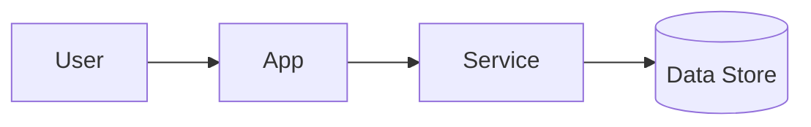
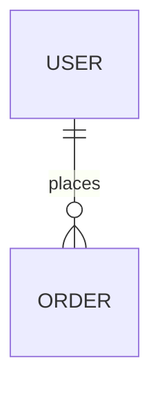
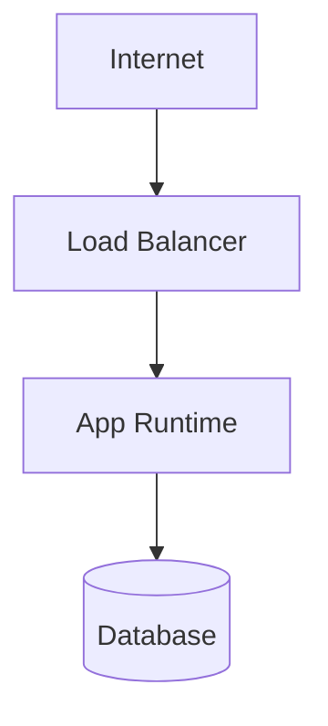

# Alejo SAD

Create a compact Solution Architecture Document. Optimize the architecture for the highest-priority quality attributes and make trade-offs explicit.

## Process

1. Use the current context window first. Then inspect relevant Linear Project Documents (`PRD`, `Q&A`, `CONTEXT.md`, `prototype.html`), local mirrors such as latest `docs/questions/` logs, prototype reports in `docs/prototypes/`, `CONTEXT.md`/`CONTEXT-MAP.md`, ADRs, plans, code, and other prior Alejo-skill outputs.
2. If unclear, ask exactly these initial quality-attribute questions one at a time as multiple choice. For each, put the recommended option first with a short rationale, then let the user confirm/correct:
   - Which 3 quality attributes should drive the architecture?
   - What measurable targets or constraints define success for them?
   - Which trade-offs are acceptable to improve them?
3. Draft one Markdown SAD. In Linear-configured repos, publish it to the Linear Project document named `SAD` by default, or `SAT` only when the repo/user already uses that title. A local `docs/architecture/YYYY-MM-DD-<topic>-sad.md` file may be used as a working copy or mirror, but it is not the canonical published artifact.
4. Use Mermaid for every diagram. Keep diagrams simple, high-level, complete, and truthful to the architecture that should be implemented. Do not use image files or prose-only diagrams.
5. Use prototype evidence to inform architecture and trade-offs, but do not treat prototype code as production design unless the user explicitly approved promoting it.
6. Require vertical-slice code organization in the SAD so later `alejo-issues` slices can map each user-facing capability to one feature folder.
7. Link ADRs for major decisions; create or propose ADRs for new hard-to-reverse decisions.

## Quality Attributes

Use this checklist, then keep only relevant attributes in the SAD: performance (latency, throughput, resource use), availability/reliability/resilience, scalability/capacity/concurrency, security/privacy/compliance, maintainability/modifiability/testability, operability/observability/auditability, data integrity/consistency/durability, interoperability/compatibility, usability/accessibility, portability/deployability, cost efficiency.

## Code Organization Rule

Every SAD must prescribe production code around vertical slices/features, not horizontal technical layers. A slice is one user-facing capability folder containing its UI, API/route, data access, tests, and shared contracts together, adapted to the repo's framework.

```text
features/
  create-order/
    CreateOrderForm.tsx
    create-order.route.ts
    create-order.db.ts
    create-order.test.ts
    create-order.types.ts
```

Do not propose catch-all layer files such as `controllers/OrderController.ts`, `services/OrderService.ts`, or `repositories/OrderRepository.ts` that mix create, cancel, update, and other capabilities. Shared code is allowed only for genuinely cross-cutting or multi-slice concerns; keep it small and name why it is shared. If a framework requires conventional route/app files, document the thin adapter mapping and keep slice-owned logic, tests, and contracts colocated with the feature.

## Diagram Discipline

Every diagram should be readable in one glance and accurate enough to guide implementation.

- Prefer 5-9 meaningful nodes. Use more only when omitting a node would make the architecture untruthful.
- Show major actors, runtimes, trust boundaries, durable stores, and external integrations. Move classes, functions, files, methods, prompt steps, retry branches, labels, and per-field details into prose or tables.
- Use one edge per important relationship. Label edges only when the protocol, direction, or data contract is architecturally important.
- For components/connectors, show responsibilities and integration paths, not internal call stacks.
- For data diagrams, show durable entities and ownership boundaries, not every attribute.
- For deployment/network diagrams, show environments, runtime boundaries, public/private edges, stores, queues, and third-party systems. Avoid subnet, port, firewall, container, and job-level detail unless it is a key design decision.
- Do not invent services, networks, queues, databases, or agents just to make a diagram look complete. Mark optional or future elements explicitly, or leave them out.
- If a diagram becomes dense, replace detail with a simpler overview plus a short table of details.

## SAD Template

````md
# Solution Architecture Document: {Title}

## Context
{Purpose, scope, assumptions, links to PRD/context/prototype reports/ADRs.}

## Prototype Evidence
| Question tested | Result | Architectural impact |
|---|---|---|
| {prototype question} | {evidence summary} | {decision, constraint, risk, or no impact} |

## Functional Requirements
- {Capability}

## Quality Attributes
| Attribute | Target | Architectural response | Trade-off |
|---|---|---|---|
| {name} | {metric/SLA/constraint} | {design choice} | {cost/risk} |

## Architecture
{Short explanation of the chosen architecture and why it fits the top quality attributes.}

## Code Organization
{Describe how future vertical slices map to feature folders. Avoid horizontal controller/service/repository ownership.}

```text
features/
  {capability-slug}/
    {Capability}View.tsx
    {capability-slug}.route.ts
    {capability-slug}.db.ts
    {capability-slug}.test.ts
    {capability-slug}.types.ts
```

Shared code: {Only cross-cutting or multi-slice modules, with rationale.}

Framework mapping: {If the framework requires route/app files elsewhere, explain the thin adapter to slice-owned logic.}

### Components And Connectors
{One-sentence purpose: what this diagram helps the reader understand.}



### Data Layer
{One-sentence purpose: what durable data relationships or ownership boundaries matter.}



### Deployment
{One-sentence purpose: what runtime, trust, and network boundaries matter.}



## Security
{Identity/authn/authz, secrets, encryption, network boundaries, privacy/compliance, threat assumptions.}

## Operations
{Monitoring, alerting, audit logs, backup/restore, incident response, SLO/SLA expectations, runbooks.}

## ADR Links
- {ADR title}: {path/link}

## Risks And Open Questions
- {Risk or question}
````
